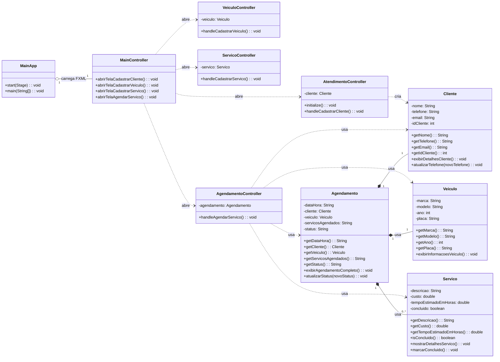

# Sistema de Oficina Mecânica — JavaFX

## 1. Contexto e Objetivo do Sistema
Um sistema desktop (JavaFX) para uma oficina mecânica, focado no cadastro de clientes, veículos, serviços e agendamentos. A aplicação visa organizar informações, reduzir retrabalho e dar visibilidade ao status dos atendimentos.

**Atores principais:**
- **Atendente:** realiza cadastros e cria agendamentos.
- **Mecânico:** consulta agendamentos e serviços a executar.
- **Gerente:** acompanha indicadores e status de atendimentos.

**Escopo:** entidades `Cliente`, `Veículo`, `Serviço` e `Agendamento`, além dos controladores de UI correspondentes (`AgendamentoController`, `ServicoController`, `VeiculoController`).

---

## 2. Elicitação de Requisitos
A seguir, requisitos funcionais (RF) e não funcionais (RNF) inferidos do código-fonte e do domínio típico de uma oficina.

### 2.1 Requisitos Funcionais (RF)

#### RF-01 — Gerenciar Cliente
- **RF-01.1:** Cadastrar cliente com nome, telefone, email, idCliente.
- **RF-01.2:** Consultar dados de cliente.
- **RF-01.3:** Atualizar telefone/email de cliente.

#### RF-02 — Gerenciar Veículo
- **RF-02.1:** Cadastrar veículo com marca, modelo, ano, placa.
- **RF-02.2:** Consultar dados de veículo e exibir informações.

#### RF-03 — Gerenciar Serviço
- **RF-03.1:** Cadastrar serviço com descricao, custo, tempoEstimadoEmHoras e flag concluido.
- **RF-03.2:** Consultar detalhes de serviço e marcar como concluído.

#### RF-04 — Gerenciar Agendamento
- **RF-04.1:** Criar agendamento com dataHora, associando Cliente e Veiculo.
- **RF-04.2:** Registrar servicosAgendados (texto descritivo no escopo atual do código).
- **RF-04.3:** Atualizar status do agendamento.
- **RF-04.4:** Exibir agendamento completo.

#### RF-05 — Navegação/Controle (UI JavaFX)
- **RF-05.1:** Controladores de tela para operações de cadastro e consulta: `AgendamentoController`, `ServicoController`, `VeiculoController`, `MainController`.

> **Nota:** O atributo `servicosAgendados` é `String` no código atual. Recomenda-se evoluir para relação 1:N entre `Agendamento` e `Servico`.

### 2.2 Requisitos Não Funcionais (RNF)
- **RNF-01 Usabilidade:** UI simples e consistente (JavaFX), com rotas/telas claras para cada cadastro.
- **RNF-02 Confiabilidade:** getters e métodos de exibição presentes nas entidades para reduzir erros de binding na UI.
- **RNF-03 Manutenibilidade:** separação entre model (entidades) e controllers para a camada de apresentação.
- **RNF-04 Desempenho:** operações de cadastro/consulta devem ocorrer em tempo aceitável localmente.
- **RNF-05 Portabilidade:** aplicação em Java, executável em múltiplas plataformas com Java Runtime compatível.

---

## 3. Validação dos Requisitos

### 3.1 Critérios de Aceitação (exemplos)

- **RF-01 (Cliente):** Dado um cliente válido, quando salvo, então devo conseguir visualizar nome, telefone, email e idCliente pelos getters. Ao atualizar telefone, o método dedicado deve refletir imediatamente o novo valor.
- **RF-02 (Veículo):** Dado um veículo cadastrado, quando consulto, então devo ver marca, modelo, ano e placa corretamente.
- **RF-03 (Serviço):** Ao marcar um serviço como concluído, o método `marcarConcluido()` deve alterar o estado de `concluido` para `true`.
- **RF-04 (Agendamento):** Ao criar um agendamento, deve haver associação válida a Cliente e Veiculo, possuir dataHora, status inicial coerente e apresentar tudo em `exibirAgendamentoCompleto()`.

### 3.2 Casos de Teste de Alto Nível

- **CT-01:** Criar Cliente → Ler com getters → Atualizar telefone → Confirmar mudança.
- **CT-02:** Criar Veículo → Exibir informações.
- **CT-03:** Criar Serviço → Mostrar detalhes → Marcar concluído → Verificar flag concluído.
- **CT-04:** Criar Agendamento (Cliente + Veículo + dataHora + servicosAgendados) → Atualizar status → Exibir agendamento completo.

---

## 4. Abstração de Classes e Modelagem

### 4.1 Entidades de Domínio

#### Cliente
- **Atributos:** `nome:String`, `telefone:String`, `email:String`, `idCliente:int`
- **Responsabilidades:** disponibilizar dados por meio de getters, exibir detalhes e permitir atualização de telefone.

#### Veiculo
- **Atributos:** `marca:String`, `modelo:String`, `ano:int`, `placa:String`
- **Responsabilidades:** getters para consulta e método para exibir informações de veículo.

#### Servico
- **Atributos:** `descricao:String`, `custo:double`, `tempoEstimadoEmHoras:double`, `concluido:boolean`
- **Responsabilidades:** getters/visualização de detalhes e alteração do estado para concluído.

#### Agendamento
- **Atributos:** `dataHora:String`, `cliente:Cliente`, `veiculo:Veiculo`, `servicosAgendados:String`, `status:String`
- **Responsabilidades:** consulta de dados (getters), exibição completa e atualização de status.

### 4.2 Controladores (camada de apresentação)
`AgendamentoController`, `ServicoController`, `VeiculoController`, `MainController` — intermediam a interação UI→modelo, acionando operações de cadastro, consulta e exibição.

### 4.3 Relacionamentos

- **Agendamento → Cliente (associação):** um agendamento referencia exatamente um cliente.
- **Agendamento → Veiculo (associação):** um agendamento referencia exatamente um veículo.
- **Agendamento → Servico:** no código atual é apenas uma String descritiva (`servicosAgendados`). Recomenda-se evoluir para coleção de `Servico` (1:N).

---

## 5. Diagrama de Classes UML

---

## Observações Finais

- O projeto segue boas práticas de separação entre entidades de domínio e controladores de UI.
- Recomenda-se evoluir o atributo `servicosAgendados` para uma coleção de objetos `Servico`.
- O sistema é multiplataforma, bastando Java Runtime para execução.

